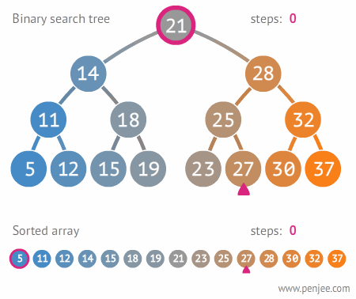
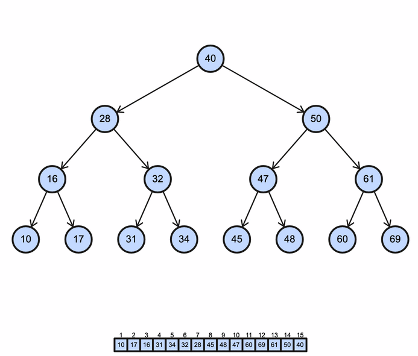

# 0x1D. C - Binary Trees

This project is part of the Alx - SE curriculum of software engineering. The main objective is to understand and implement the concepts of binary trees in C.

## Authors

- Mohamed Elfadil Ali
- Mohannad Babeker

## Learning Objectives

- Understand what a binary tree is.
- Learn the difference between a binary tree and a Binary Search Tree (BST).
- Understand the potential time complexity advantages of binary trees compared to linked lists.
- Learn about the depth, height, and size of a binary tree.
- Understand the different traversal methods to navigate through a binary tree.
- Learn what complete, full, perfect, and balanced binary trees are.

## Project Overview

The project is divided into several sections, each focusing on a different type of tree and the operations that can be performed on them.

### Binary Trees
<div style="display: flex; flex-direction: row; justify-content: space-between;">
<div>


- Node creation, insertion, and deletion
- Leaf and root identification
- Traversal methods: pre-order, in-order, post-order
- Measurement of height, depth, size, and balance factor
- Identification of full or perfect binary trees
- Sibling and uncle identification

</div>
<div>

</div>
</div>


### Binary Search Trees (BST)

<div style="display: flex; flex-direction: row; justify-content: space-between;">
<div>

- Validation of BST
- Value insertion
- BST construction from an array
- Value search
- Node removal

</div>
<div>

</div>
</div>

### AVL Trees
<div style="display: flex; flex-direction: row; justify-content: space-between;">
<div>

- Validation of AVL Tree
- Value insertion
- AVL tree construction from an array
- Node removal
- AVL tree construction from a sorted array
</div>
<div>

</div>
</div>


### Binary Heaps
<div style="display: flex; flex-direction: row; justify-content: space-between;">
<div>

- Validation of Max Binary Heap
- Value insertion
- Max Binary Heap construction from an array
- Root node extraction
- Conversion of Binary Max Heap to a sorted array of integers
</div>
<div>

</div>
</div>


## Time and Space Complexity Analysis of Binary Tree Operations

| Operation                    | Best Case | Average Case | Worst Case |
| ---------------------------- | :-------: | :----------: | :--------: |
| **Binary Tree**              |           |              |            |
| Insertion                    | O(1)      | O(log n)     | O(n)       |
| Deletion                     | O(1)      | O(log n)     | O(n)       |
| Search                       | O(1)      | O(log n)     | O(n)       |
| **Binary Search Tree (BST)** |           |              |            |
| Insertion                    | O(log n)  | O(log n)     | O(n)       |
| Deletion                     | O(log n)  | O(log n)     | O(n)       |
| Search                       | O(log n)  | O(log n)     | O(n)       |
| **AVL Tree**                 |           |              |            |
| Insertion                    | O(log n)  | O(log n)     | O(log n)   |
| Deletion                     | O(log n)  | O(log n)     | O(log n)   |
| Search                       | O(log n)  | O(log n)     | O(log n)   |
| **Binary Heap**              |           |              |            |
| Insertion                    | O(1)      | O(log n)     | O(log n)   |
| Deletion                     | O(log n)  | O(log n)     | O(log n)   |
| Search                       | O(1)      | O(n)         | O(n)       |


## Binary Tree Traversal
There are 2 main ways to traverse a binary tree, namely Depth First Search (DFS) and Breadth First Search (BFS).

### Depth First Search (DFS)

- **In-order traversal:** left subtree -> root -> right subtree
    - This is the most common traversal method. In the case of a binary search tree, it visits the nodes in ascending order (hence the name).

    

- **Pre-order traversal:** root -> left subtree -> right subtree
    - This traversal method is useful to create a copy of the tree.

    

- **Post-order traversal:** left subtree -> right subtree -> root
    - This traversal method is useful to delete a tree.

    


### Breadth First Search (BFS)

- **Level-order traversal:** root -> left node -> right node
    - This traversal method is useful to find the shortest path between two nodes. The first node is visited, then its children are visited, and so on. Its useful to place the nodes in a FIFO queue in the order they are visited. THen the first node is popped from the queue and its children are visited. This process is repeated until the queue is empty.

    


## Usage
Clone the repository into your local machine:

```bash
git clone https://github.com/Mohabdo21/binary_trees.git
cd binary_trees
```
### Using the Makefile
To compile the project using the Makefile, run the following commands
```bash
make        #this will default to task 0
# or
make all    #this will default to task 0
# or for a specific task
make task TASK_NUM=n # where n is the task number
# then run the binary
./binary_trees
```
**#NOTE:** The `TASK_NUM` variable actually refers to the file number and they aren't necessarily sequential, so task 31 is actually 121 in file number so you should use 121 for the Makefile. To avoid having to determine which file you are actually interested in, use the shell script method outlined in the next section.
To clean up
```bash
make clean
```
To remake and clean
```bash
make re TASK_NUM=n # where n is the task number
```
**#NOTE:** You can use the `-s` flag with make to silence the output.
e.g. `make -s task TASK_NUM=n`


### Using the shell script
There are task numbers ranging from 0 to 40. Execute the shell script `task.sh` as such:
```bash
./task.sh <task number>
# eg.
.task.sh 31
```

## Additional Resources

- `binary_tree_print.c`: A utility function for printing a binary tree.
- `binary_trees.h`: The header file containing the function prototypes and the necessary structures for building a binary tree.

## Note

For more details and usage examples, please refer to the individual files.
